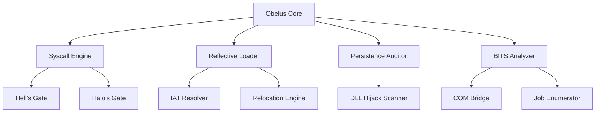

# Obelus

---

Obelus is a minimalist security research framework designed for deep-system analysis and defensive validation on Windows environments. It emphasizes low-level system interaction, memory forensics, and stealth technique simulation to assist researchers in understanding modern adversary behavior.

## Core Capabilities

- **Syscall Abstraction**: Dynamic resolution of System Service Numbers (SSNs) via Hell's Gate and Halo's Gate to audit user-land security hooks.
- **Reflective Mapping**: Functional in-memory PE loader and mapper for module analysis without disk presence.
- **Persistence Auditing**: Real-time scanning for Search Order Hijacking vulnerabilities and BITS persistence vectors.
- **OpSec Primitives**: Runtime API hashing and encrypted artifacts for signature minimization.

## Architecture Overview



## Setup and Development

Obelus utilizes an automated build system. Ensure Visual Studio 2022 (C++ workload) is installed.

```cmd
git clone https://github.com/denizZz009/obelus
cd obelus
build.bat
```

The `build.bat` script automatically initializes the x64 developer environment and compiles the project dependencies (`shell32.lib`, `ole32.lib`).

## Operating Instructions

Execute the binary from the build path:
```cmd
build\Obelus.exe
```

## Security Disclaimer

[WARNING] Obelus is for authorized security testing and education only. Unauthorised usage against systems is strictly prohibited. The developers accept no responsibility for misuse.
