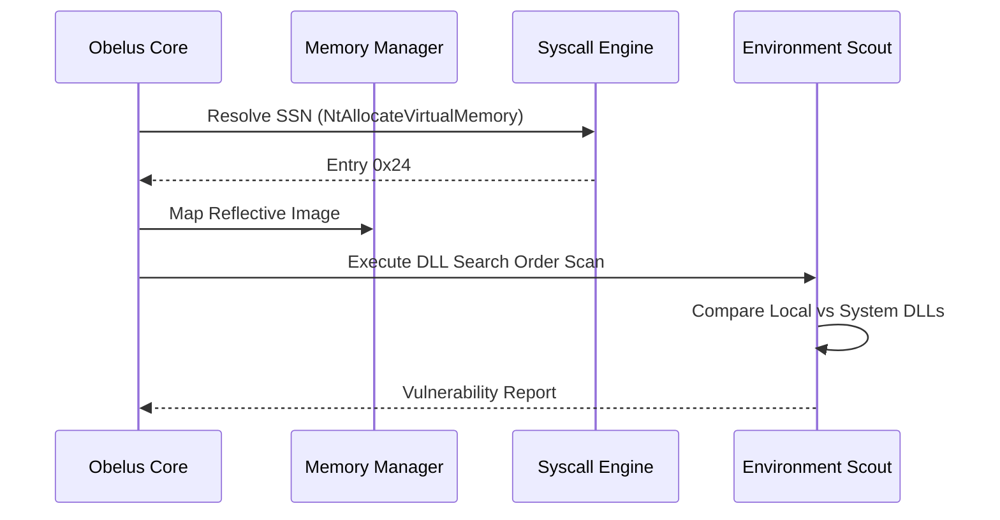

# OBELUS TECHNICAL SPECIFICATIONS
---

## Technical Architecture

Obelus is built on C++17 with MASM syscall stubs, focusing on high-performance system analysis with minimal overhead.

### Component Breakdown

#### 1. Direct Syscall Subsystem
Implements Hell's Gate for dynamic SSN resolution. In cases where the target function in `ntdll.dll` is hooked (e.g., by EDR), Halo's Gate logic walks the export table to derive the syscall number from adjacent unhooked functions.

#### 2. Reflective Loading Layer
The loader performs manual mapping of PE files into memory:
- **IAT Resolution**: Dynamically maps dependencies and patches the Import Address Table.
- **Base Relocation**: Processes the `.reloc` table to adjust absolute addresses if the module is not loaded at its preferred base.

#### 3. Persistence Discovery Engine
Audits the system for common persistence vectors:
- **DLL Hijacking**: Scans executable directories for local DLLs that shadow system-level binaries.
- **BITS Jobs**: Enumerates tasks within the Background Intelligent Transfer Service using `IBackgroundCopyManager`.

## Data Flow Diagram

## Implementation Details

- **Language**: C++17 / x64 Assembly
- **Compiler**: MSVC / ML64
- **Linker Dependencies**: `shell32.lib`, `ole32.lib`

